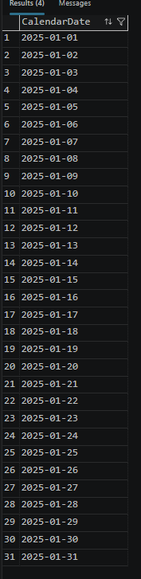
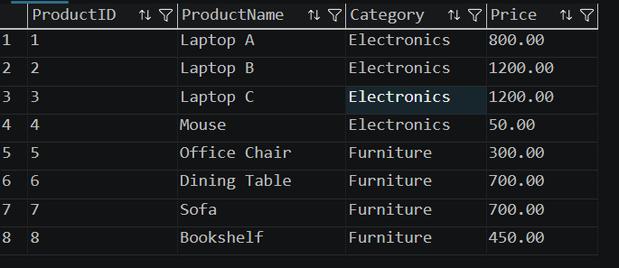
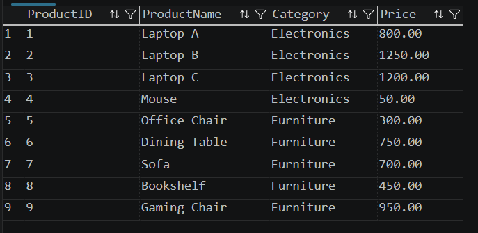
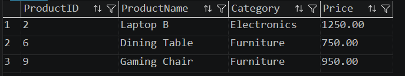

# Output

## 1. Recursive CTE Output

The recursive CTE successfully generated a calendar containing dates from **2025-01-01** to **2025-01-31**.

### Screenshot

---

## 2. Products Before MERGE

The following screenshot shows the contents of the **Products** table before executing the MERGE statement.

### Screenshot

| ProductID | ProductName | Category | Price |
|-----------|-------------|----------|------:|
|1|Laptop A|Electronics|800.00|
|2|Laptop B|Electronics|1200.00|
|3|Laptop C|Electronics|1200.00|
|4|Mouse|Electronics|50.00|
|5|Office Chair|Furniture|300.00|
|6|Dining Table|Furniture|700.00|
|7|Sofa|Furniture|700.00|
|8|Bookshelf|Furniture|450.00|

---

## 3. Products After MERGE

The MERGE statement updated the existing product prices and inserted a new product.

### Screenshot

| ProductID | ProductName | Category | Price |
|-----------|-------------|----------|------:|
|1|Laptop A|Electronics|800.00|
|2|Laptop B|Electronics|1250.00|
|3|Laptop C|Electronics|1200.00|
|4|Mouse|Electronics|50.00|
|5|Office Chair|Furniture|300.00|
|6|Dining Table|Furniture|750.00|
|7|Sofa|Furniture|700.00|
|8|Bookshelf|Furniture|450.00|
|9|Gaming Chair|Furniture|950.00|

---

## 4. StagingProducts Table

The staging table contains updated records that are used by the MERGE statement.

### Screenshot

| ProductID | ProductName | Category | Price |
|-----------|-------------|----------|------:|
|2|Laptop B|Electronics|1250.00|
|6|Dining Table|Furniture|750.00|
|9|Gaming Chair|Furniture|950.00|

---

## Observation

- The recursive CTE generated all dates from **01-Jan-2025** to **31-Jan-2025**.
- The **MERGE** statement updated the prices of existing products.
- **Laptop B** price changed from **1200.00** to **1250.00**.
- **Dining Table** price changed from **700.00** to **750.00**.
- A new product, **Gaming Chair**, was inserted into the `Products` table.
- MERGE performed both **UPDATE** and **INSERT** operations in a single statement.

---

## Conclusion

This exercise demonstrates the use of **Recursive Common Table Expressions (CTEs)** to generate sequential dates and the **MERGE** statement to synchronize data between a staging table and the main `Products` table. The MERGE statement simplifies data maintenance by combining update and insert operations into a single SQL command.
