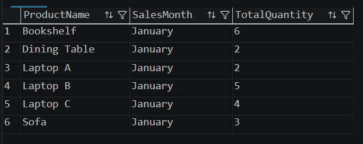
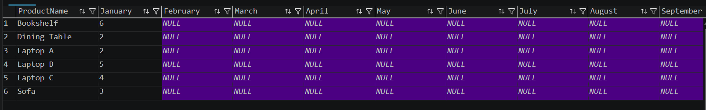
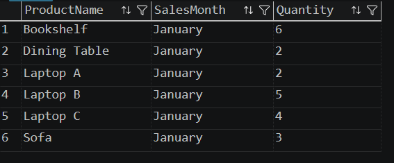

# Output

## Aggregate Sales by Product and Month

---

## PIVOT Output

---

## UNPIVOT Output

---

## Observation

- Sales quantities were aggregated based on Product and Month.
- The PIVOT operation converted monthly sales values from rows into columns.
- The UNPIVOT operation converted the pivoted columns back into rows.
- PIVOT and UNPIVOT simplify reporting and data transformation in SQL Server.

---

## Conclusion

This exercise demonstrated the use of **PIVOT** and **UNPIVOT** operators in SQL Server. The PIVOT operator transformed row-based sales data into a column-based report, while the UNPIVOT operator restored the data back into its original row format. These operations are commonly used for reporting and business intelligence.
