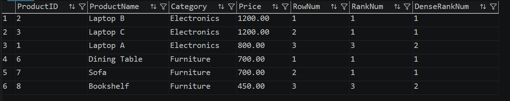

# Output

The following query retrieves the **Top 3 most expensive products** from each category using `ROW_NUMBER()`, `RANK()`, and `DENSE_RANK()`.

## Output Screenshot

---

## Result

| ProductID | ProductName | Category | Price | RowNum | RankNum | DenseRankNum |
|-----------|-------------|----------|------:|-------:|--------:|-------------:|
| 2 | Laptop B | Electronics | 1200.00 | 1 | 1 | 1 |
| 3 | Laptop C | Electronics | 1200.00 | 2 | 1 | 1 |
| 1 | Laptop A | Electronics | 800.00 | 3 | 3 | 2 |
| 6 | Dining Table | Furniture | 700.00 | 1 | 1 | 1 |
| 7 | Sofa | Furniture | 700.00 | 2 | 1 | 1 |
| 8 | Bookshelf | Furniture | 450.00 | 3 | 3 | 2 |

---

## Observation

- `ROW_NUMBER()` assigns a unique sequential number to each row within each category.
- `RANK()` assigns the same rank to tied values and skips the next rank.
- `DENSE_RANK()` assigns the same rank to tied values without skipping subsequent ranks.
- `PARTITION BY` divides the data into categories before ranking.
- `ORDER BY Price DESC` ranks products from the highest to the lowest price.

---

## Conclusion

This exercise demonstrates how SQL Window Functions can be used to rank records within groups and compare the behavior of different ranking functions when duplicate values exist.
