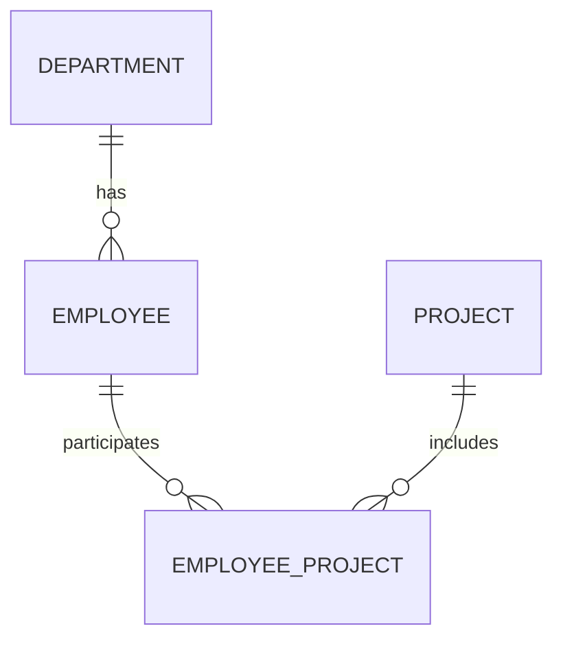

# Handling Relationships and Data Loading

## Introduction

Entity Framework Core provides powerful features to define relationships between entities and efficiently load related data. Relationships are established using navigation properties, primary keys, and foreign keys. EF Core also supports multiple data loading strategies, including Eager Loading, Lazy Loading, and Explicit Loading.

This topic explains relationship types, loading strategies, and handling circular references in Entity Framework Core 8.

---

## Entity Relationships

Relationships define how entities are connected within a database.

### Types of Relationships

* One-to-One
* One-to-Many
* Many-to-Many

---

## One-to-One Relationship

Each record in one table is associated with exactly one record in another table.

### Example

```csharp
public class Person
{
    public int PersonId { get; set; }

    public string Name { get; set; }

    public Passport Passport { get; set; }
}

public class Passport
{
    public int PassportId { get; set; }

    public string PassportNumber { get; set; }

    public int PersonId { get; set; }

    public Person Person { get; set; }
}
```

---

## One-to-Many Relationship

One parent record can have multiple child records.

### Example

```csharp
public class Department
{
    public int DepartmentId { get; set; }

    public string DepartmentName { get; set; }

    public ICollection<Employee> Employees { get; set; }
}

public class Employee
{
    public int EmployeeId { get; set; }

    public string EmployeeName { get; set; }

    public int DepartmentId { get; set; }

    public Department Department { get; set; }
}
```

---

## Many-to-Many Relationship

Multiple records from one table are related to multiple records in another table.

### Example

```csharp
public class Student
{
    public int StudentId { get; set; }

    public string Name { get; set; }

    public ICollection<Course> Courses { get; set; }
}

public class Course
{
    public int CourseId { get; set; }

    public string CourseName { get; set; }

    public ICollection<Student> Students { get; set; }
}
```
# 07 - Handling Relationships and Data Loading

This repository contains a .NET 8 console application demonstrating entity relationship mapping and data loading strategies using Entity Framework Core 8.

---

## Project Structure & Architecture

The application defines a database schema representing **Departments**, **Employees**, and **Projects** to model different relationship types:



### Models

* **[Department](file:///c:/Users/subbu/Downloads/07-Handling-Relationships-and-Data-Loading/07-Handling-Relationships-and-Data-Loading/Code/RelationshipsDemo/Models/Department.cs)**: A one-to-many relationship with `Employee`.
* **[Employee](file:///c:/Users/subbu/Downloads/07-Handling-Relationships-and-Data-Loading/07-Handling-Relationships-and-Data-Loading/Code/RelationshipsDemo/Models/Employee.cs)**: Belongs to a single `Department` and participates in multiple `Projects` via a join entity.
* **[Project](file:///c:/Users/subbu/Downloads/07-Handling-Relationships-and-Data-Loading/07-Handling-Relationships-and-Data-Loading/Code/RelationshipsDemo/Models/Project.cs)**: Can be assigned to multiple employees.
* **[EmployeeProject](file:///c:/Users/subbu/Downloads/07-Handling-Relationships-and-Data-Loading/07-Handling-Relationships-and-Data-Loading/Code/RelationshipsDemo/Models/EmployeeProject.cs)**: The intermediate join table representing the many-to-many relationship, with a composite key composed of `EmployeeId` and `ProjectId`.

---

## Getting Started

### Prerequisites
* **.NET 8 SDK** installed.
* **SQL Server** instance running locally on `localhost` (default instance).
* **EF Core CLI Tools** installed. You can install it globally via:
  ```bash
  dotnet tool install --global dotnet-ef
  ```

### Configuration
The application settings are configured in [appsettings.json](file:///c:/Users/subbu/Downloads/07-Handling-Relationships-and-Data-Loading/07-Handling-Relationships-and-Data-Loading/Code/RelationshipsDemo/appsettings.json):
```json
{
  "ConnectionStrings": {
    "DefaultConnection": "Server=localhost;Database=RelationshipsDemoDB;Trusted_Connection=True;TrustServerCertificate=True;"
  }
}
```

### Database Migrations
1. **Generate migration**: Generates the EF Core migration code for the models.
   ```bash
   dotnet ef migrations add InitialCreate
   ```
2. **Apply migrations**: Creates the database and applies tables.
   ```bash
   dotnet ef database update
   ```

### Run the Project
To run the console application, execute:
```bash
dotnet run
```

---

## Key EF Core Concepts Covered

### 1. Defining Relationships

* **One-to-Many** (`Department` $\rightarrow$ `Employee`):
  Defined by the navigation properties `Department.Employees` and `Employee.Department`.
* **Many-to-Many** (`Employee` $\leftrightarrow$ `Project`):
  Configured explicitly using the join entity `EmployeeProject` inside the `OnModelCreating` method in [AppDbContext.cs](file:///c:/Users/subbu/Downloads/07-Handling-Relationships-and-Data-Loading/07-Handling-Relationships-and-Data-Loading/Code/RelationshipsDemo/Data/AppDbContext.cs) with a composite key:
  ```csharp
  modelBuilder.Entity<EmployeeProject>().HasKey(x => new { x.EmployeeId, x.ProjectId });
  ```

### 2. Design-Time DbContext Instantiation
Since this is a console application, EF Core CLI tools cannot automatically resolve construction of `AppDbContext` at design-time. To handle this, the project implements [AppDbContextFactory](file:///c:/Users/subbu/Downloads/07-Handling-Relationships-and-Data-Loading/07-Handling-Relationships-and-Data-Loading/Code/RelationshipsDemo/Data/AppDbContextFactory.cs):
```csharp
public class AppDbContextFactory : IDesignTimeDbContextFactory<AppDbContext>
{
    public AppDbContext CreateDbContext(string[] args)
    {
        var configuration = new ConfigurationBuilder()
            .SetBasePath(Directory.GetCurrentDirectory())
            .AddJsonFile("appsettings.json")
            .Build();

        var builder = new DbContextOptionsBuilder<AppDbContext>();
        builder.UseSqlServer(configuration.GetConnectionString("DefaultConnection"));

        return new AppDbContext(builder.Options);
    }
}
```

### 3. Data Loading Strategies (EF Core)

Below is an overview of how the different loading strategies would be written in this codebase:

#### A. Eager Loading
Loads related data from the database as part of the initial query using the `.Include()` and `.ThenInclude()` methods.
```csharp
var employees = db.Employees
    .Include(e => e.Department)
    .Include(e => e.EmployeeProjects)
        .ThenInclude(ep => ep.Project)
    .ToList();
```

#### B. Explicit Loading
Explicitly loads related data for a specific entity that is already loaded/tracked by the context using the `Entry()` API.
```csharp
var employee = db.Employees.First();

// Load reference property (One-to-One / Many-to-One)
db.Entry(employee).Reference(e => e.Department).Load();

// Load collection property (One-to-Many / Many-to-Many)
db.Entry(employee).Collection(e => e.EmployeeProjects).Load();
```

#### C. Lazy Loading
Loads related data on-demand when the navigation property is accessed. (Requires the `Microsoft.EntityFrameworkCore.Proxies` package, marking navigation properties as `virtual`, and configuring `.UseLazyLoadingProxies()`).
```csharp
// Accessing the property automatically triggers a database query in the background:
var deptName = employee.Department.Name;
```

---
