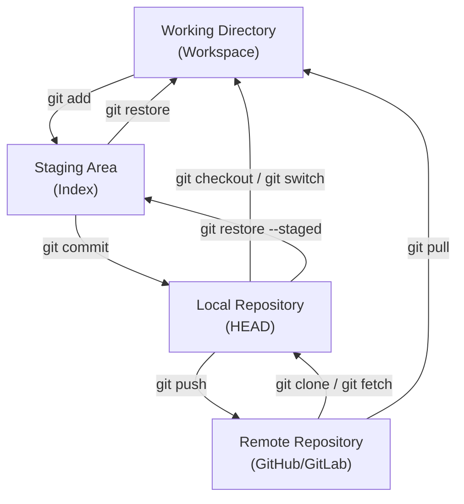
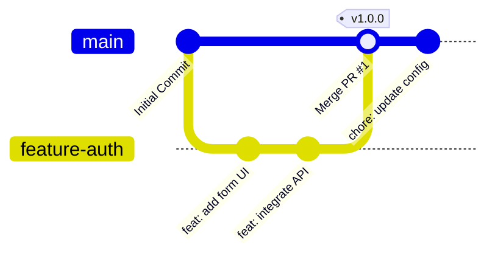
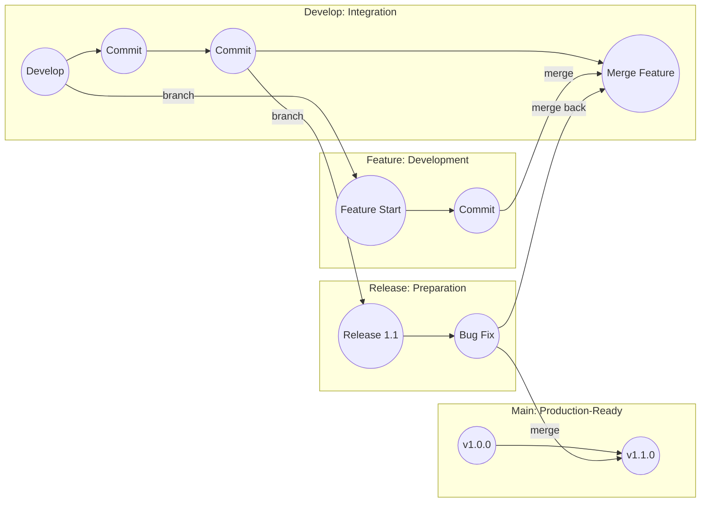
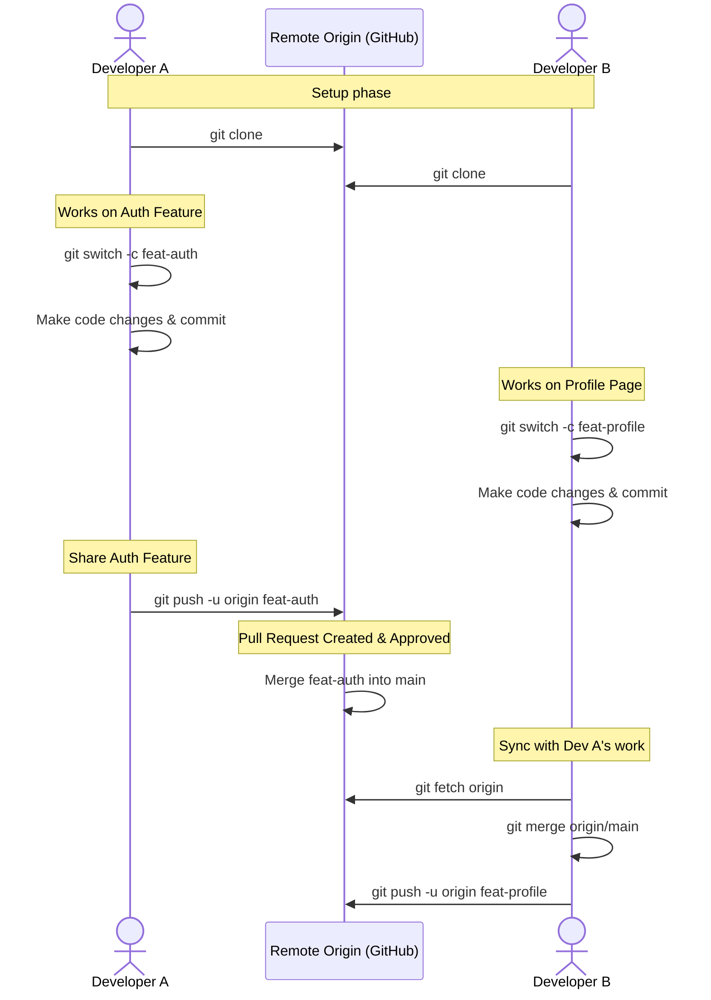

# Git Workflow Diagrams

This document contains visual representations of key Git concepts and branching strategies using Mermaid diagrams.

---

## 1. Git Architecture & File Lifecycle

This diagram demonstrates how files transition between the four zones of Git, showing the command used for each transition.

---

## 2. GitHub Flow

A lightweight, branch-based workflow that is ideal for continuous deployment.

### Steps:
1. **Branch**: Create a branch off `main` with a descriptive name (e.g., `feature-login`).
2. **Commit**: Save your changes to your branch locally and push to your remote branch.
3. **Pull Request**: Open a Pull Request (PR) to discuss, review, and test your code.
4. **Merge**: Once approved, merge the PR into `main` and deploy to production.

---

## 3. Gitflow Workflow

A strict branching model designed around project releases. Excellent for projects with scheduled releases and multiple environments.

### Branches:
* **`main`**: Stores official release history. Every commit on `main` represents a production-ready release.
* **`develop`**: Serves as an integration branch for features.
* **`feature/*`**: Branched from `develop` for specific new features; merged back into `develop` when finished.
* **`release/*`**: Branched from `develop` when preparing a new production release; merged into both `main` and `develop`.
* **`hotfix/*`**: Branched from `main` to address critical bugs in production immediately; merged into both `main` and `develop`.

---

## 4. Feature Branch Workflow (Interactive Walkthrough)

This diagram shows how multiple developers collaborate using local feature branches and a shared remote origin.

