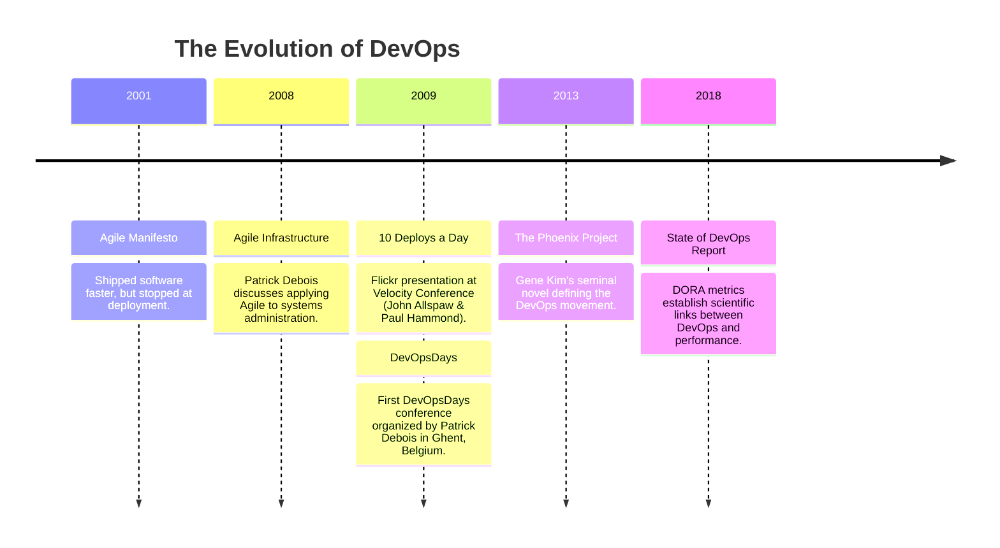
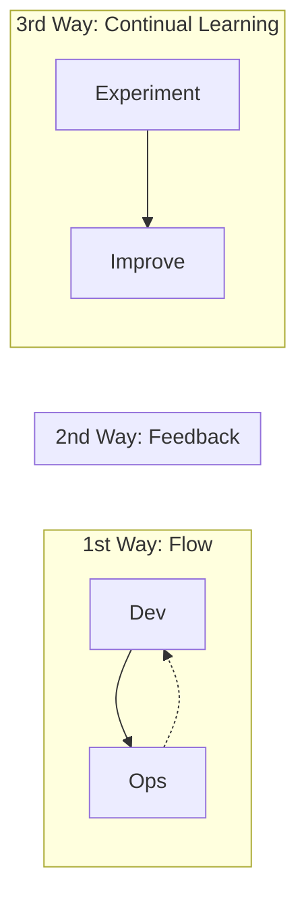
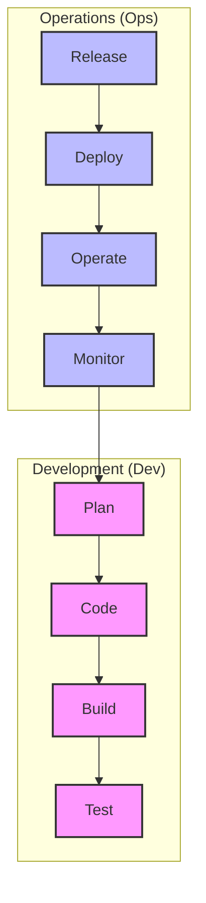

# Chapter 1 Notes: DevOps Foundations

---

## 1. The "Wall of Confusion" (Traditional IT Model)

Before DevOps, software delivery was divided into two distinct functional domains:

### Development (Dev)
* **Goal**: Deliver changes, new features, and bug fixes as quickly as possible.
* **Metrics**: Velocity, story points delivered, features shipped.
* **Perspective**: Stability is Operations' problem.

### Operations (Ops)
* **Goal**: Maintain environment uptime, service availability, and application performance.
* **Metrics**: Uptime percentage (e.g., "three nines" or `99.9%`), mean time to resolution (MTTR), service level agreements (SLAs).
* **Perspective**: Any change introduced by developers is a threat to stability.

### The Consequences
This misalignment produced the **Wall of Confusion**. Developers packaged code and "threw it over the wall" to Operations. If it crashed in production, Operations blamed the developers for writing bad code, and developers blamed Operations for poorly configuring the environment.

* **Result**: Slow releases (once/twice a year), massive and risky deployment packages, high failure rates, and low team morale.

---

## 2. What is DevOps?

**DevOps** is a cultural and professional movement that stresses communication, collaboration, integration, and automation between software developers and IT operations professionals.

> [!NOTE]
> DevOps is **not** a tool, **not** a software product, and **not** a single job title. It is a set of practices and a cultural shift.

### Core Value Proposition
* **Velocity**: Deploy features and fixes faster.
* **Reliability**: Ensure quality of updates and infrastructure changes.
* **Scale**: Manage infrastructure and development processes at scale through automation.
* **Improved Collaboration**: Build ownership and shared responsibility.
* **Security**: Incorporate security checks directly into development pipelines (DevSecOps).

---

## 3. The History & Evolution of DevOps

* **The Agile Roots**: Agile solved the communication gap between business analysts and developers, resulting in working software being produced in short cycles. However, this software still accumulated at the "Ops" boundary because Operations couldn't deploy it as quickly as developers could write it.
* **The Velocity 2009 Presentation**: John Allspaw and Paul Hammond gave a famous talk titled *"10+ Deploys per Day: Dev and Ops Cooperation at Flickr"*. This proved that cooperation and automated tooling could make deployments fast and safe.
* **Patrick Debois**: Coined the term "DevOps" by combining "Development" and "Operations" when organizing the first "DevOpsDays" conference in 2009.

---

## 4. The CALMS Framework

Coined by Jez Humble and expanded by other DevOps leaders, **CALMS** defines the five pillars of DevOps maturity:

| Pillar | Focus Area | Description |
| :--- | :--- | :--- |
| **C**ulture | People & Collaboration | Emphasizes shared responsibility, breaking down silos, and fostering a "blameless post-mortem" culture where mistakes are treated as learning opportunities. |
| **A**utomation | Technology & Speed | Removing manual errors by automating the build, test, release, and provisioning processes. Code represents everything (Infrastructure as Code). |
| **L**ean | Process Optimization | Minimizing waste by keeping batch sizes small, reducing work-in-progress (WIP), and optimizing the value stream mapping. |
| **M**easurement | Telemetry & Metrics | Gathering data on everything: deployment frequency, lead time for changes, MTTR, change failure rate, and business metrics. |
| **S**haring | Communication | Openly sharing knowledge, tools, successes, and failures across organizational boundaries. |

---

## 5. The "Three Ways" of DevOps

Defined by Gene Kim in *The Phoenix Project*, the Three Ways represent the prescriptive principles of DevOps:

### The First Way: System Thinking (Flow)
* **Goal**: Optimize the flow of work from Development to Operations (Left to Right).
* **Practices**: Keep batch sizes small, automate builds and tests, limit Work in Progress (WIP), and ensure that local optimizations do not create bottlenecks downstream.

### The Second Way: Amplify Feedback Loops (Feedback)
* **Goal**: Create a constant stream of feedback from right to left (Operations back to Development).
* **Practices**: Application monitoring, paging systems, system telemetry, and quickly notifying developers when a build or test fails so they can fix it immediately.

### The Third Way: Culture of Continual Learning & Experimentation
* **Goal**: Allocate time for experimentation, risk-taking, and learning from failure.
* **Practices**: Regular game days (testing systems under simulated failure), blameless post-mortems, and dedicating 20% of engineering cycles to fixing technical debt and optimizing processes.

---

## 6. The DevOps Lifecycle

The DevOps lifecycle is represented by an infinity loop, emphasizing that software development, delivery, and feedback are continuous processes:

1. **Plan**: Define business requirements, user stories, and map resources (Tools: Jira, Trello, GitHub Issues).
2. **Code**: Write the source code, review modifications, and manage code history (Tools: Git, VS Code).
3. **Build**: Compile source code, pull package dependencies, and package software into build artifacts (Tools: npm, Maven, Gradle, Docker).
4. **Test**: Run automated tests to verify business logic, security compliance, and performance integrity (Tools: Jest, JUnit, SonarQube).
5. **Release**: Approve build artifacts for deployment, verifying documentation and release notes (Tools: Jenkins, GitHub Releases).
6. **Deploy**: Deploy application artifacts to target infrastructure (staging, production) (Tools: Terraform, Ansible, Kubernetes).
7. **Operate**: Keep systems running smoothly, managing scaling and traffic routing (Tools: Kubernetes, Nginx, AWS).
8. **Monitor**: Collect logs, metrics, and application performance data to generate alerts and input back into the "Plan" stage (Tools: Prometheus, Grafana, ELK Stack, Datadog).

---

## 7. DevOps vs. Agile vs. SRE

It is common to confuse these terms since they overlap in goals. Here is the distinction:

* **Agile**: Focuses on optimizing the communication between product managers and developers. It helps teams adapt quickly to requirements. However, it does not explicitly address what happens to the code once it is committed.
* **DevOps**: Broadens the Agile principles to include Operations. It focuses on the automation of deployment, monitoring, infrastructure provisioning, and alignment of incentives across development and operations teams.
* **SRE (Site Reliability Engineering)**: A term coined by Google. As Ben Treynor (Google's VP of Engineering) put it: *"SRE is what happens when you ask a software engineer to design an operations function."* It is a concrete implementation of DevOps using engineering principles (e.g., defining SLAs, Error Budgets, and spending time automating away repetitive operational tasks called "toil").
