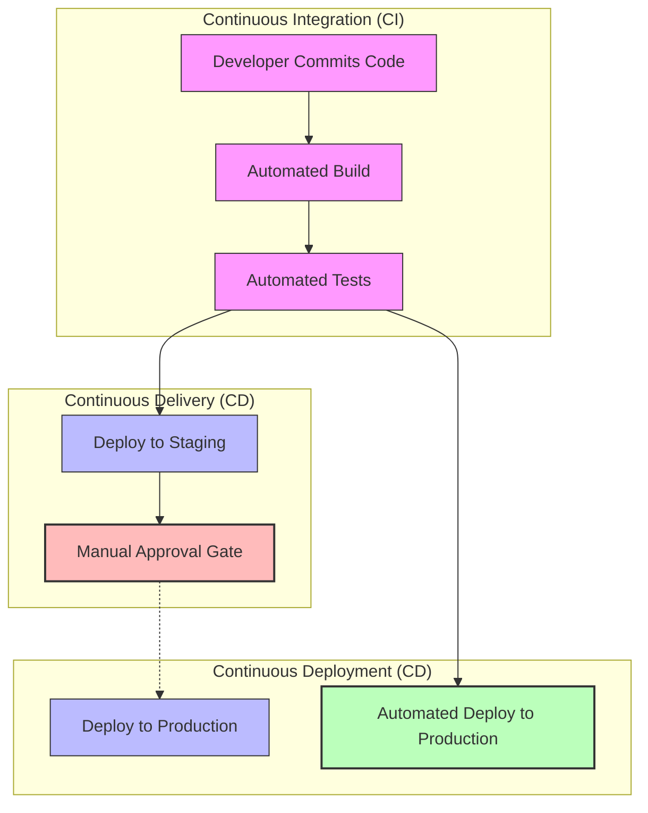
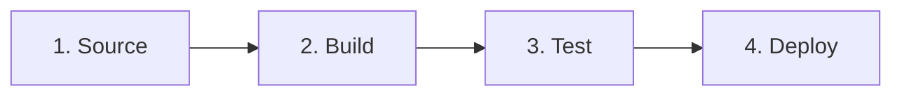

# Chapter 2 Notes: Pipelines & Deployment Strategies

---

## 1. The Core Definitions (CI vs. CD vs. CD)

While often lumped together, the terms **Continuous Integration**, **Continuous Delivery**, and **Continuous Deployment** represent separate stages of operational maturity:



### Continuous Integration (CI)
* **Goal**: Merge all developer working copies to a shared mainline (like `main` or `master`) multiple times a day.
* **Key Practices**:
  * Developers commit frequently to avoid "merge hell".
  * Every commit triggers an automated build and test runner.
  * Failures are detected immediately and must be fixed as the highest priority.

### Continuous Delivery (CD)
* **Goal**: Keep the codebase in a **deployable state** at all times.
* **Key Practices**:
  * Extends CI by automatically deploying code changes to a staging or testing environment.
  * Includes automated integration, UI, and performance tests.
  * **The Release Gate**: Actual deployment to production is a **manual decision** (e.g., clicking a button).

### Continuous Deployment (CD)
* **Goal**: Fully automate the end-to-end pipeline so that every change that passes all tests is released directly to customers without human intervention.
* **Key Practices**:
  * Requires high-confidence automated testing suites.
  * Eliminates manual approval gates.
  * Relies on automated rollbacks if post-deployment checks fail.

---

## 2. The Anatomy of a Pipeline

A deployment pipeline is the sequence of steps that software goes through to reach production. Here are the core stages:



### 1. Source Stage
* **Trigger**: A webhook in GitHub/GitLab fires when code is pushed or a pull request is created.
* **Action**: The pipeline agent checks out the specific commit hash.
* **Goal**: Retrieve the source code and environment configuration variables.

### 2. Build Stage
* **Action**: Compiles the source code (if compiled language), downloads dependencies, and builds packages.
* **Artifact Creation**: Creates a deployable artifact, such as a Docker image, `.war`/`.jar` file, or a zipped package.
* **Goal**: Package the code in a repeatable format.

### 3. Test Stage
* **Action**: Runs the automated test suite.
* **Includes**: Unit tests, integration tests, static code analysis (e.g., SonarQube), and dependency vulnerability scans (e.g., Snyk).
* **Goal**: Guarantee the functional correctness, safety, and quality of the build.

### 4. Deploy Stage
* **Action**: Provisions/configures infrastructure and deploys the artifact to target environments (Staging, UAT, Production).
* **Goal**: Put the code in front of users.

---

## 3. Build Automation & Artifact Management

A key tenet of CI/CD is: **Build once, deploy anywhere.**

> [!IMPORTANT]
> You should never compile or rebuild the source code as it moves between staging and production. Rebuilding introduces the risk of compilation changes or dependency version skew. Build the artifact once, verify it in staging, and promote the **exact same** artifact to production.

### Artifact Registries
Artifacts are stored in versioned registries for traceability and rollback purposes:
* **Container Images**: Docker Hub, Amazon Elastic Container Registry (ECR), GitHub Packages.
* **Package Registries**: npm Registry (JS), PyPI (Python), Maven Central (Java), NuGet (.NET).

---

## 4. Automated Testing Gates

A pipeline acts as a quality funnel. We structure tests by speed and scope (the Testing Pyramid):

```text
       ▲
      ╱ ╲       UI / End-to-End Tests (Slowest, most expensive)
     ╱   ╲
    ╱     ╲     Integration / API Tests (Medium speed, tests communication)
   ╱       ╲
  ╱         ╲   Unit Tests (Fastest, cheapest, tests isolated functions)
 ─────────────
```

### Static vs. Dynamic Testing in CI/CD
1. **SAST (Static Application Security Testing)**: Scans source code before compilation to identify security vulnerabilities (e.g., SQL injections, hardcoded keys). Runs during the Build/Test phase.
2. **SCA (Software Composition Analysis)**: Scans third-party dependencies for known vulnerabilities (CVEs).
3. **DAST (Dynamic Application Security Testing)**: Tests the running application from the outside by simulating attacks. Runs during the Deploy/Post-Deploy phase.

---

## 5. Modern Deployment Strategies

When deploying updates to production, you want to minimize downtime and reduce customer impact.

### 1. Recreate Strategy (Downtime)
Old version is completely shut down, then the new version is booted up.
* **Pros**: Simple; no database version conflicts.
* **Cons**: Direct downtime for users.

### 2. Rolling Update Strategy (Zero Downtime)
New instances are slowly introduced one-by-one or in batches, replacing old instances.

```text
  Active: [ V1 ] [ V1 ] [ V1 ]  (Initial state)
  Step 1: [ V2 ] [ V1 ] [ V1 ]  (Deploy first V2 instance)
  Step 2: [ V2 ] [ V2 ] [ V1 ]  (Deploy second V2, decommission old)
  Step 3: [ V2 ] [ V2 ] [ V2 ]  (Fully upgraded)
```
* **Pros**: Zero downtime; resources are reused.
* **Cons**: Version skew (both V1 and V2 serve traffic simultaneously, requiring backward-compatible APIs).

### 3. Blue-Green Strategy (Zero Downtime, Rapid Rollback)
Two identical environments exist: Blue (active production) and Green (inactive staging containing new code).

```text
                        ┌──────────────┐
                        │ Router/DNS   │
                        └──────┬───────┘
                               │ (Switch traffic)
                ┌──────────────▼──────────────┐
                │                             │
        ┌───────▼───────┐             ┌───────▼───────┐
        │ ENVIRONMENT   │             │ ENVIRONMENT   │
        │    BLUE       │             │    GREEN      │
        │ (Old Version) │             │ (New Version) │
        └───────────────┘             └───────────────┘
```
* **Pros**: Zero downtime; instant rollback by switching the router back to Blue.
* **Cons**: Double the resource cost; database schema changes must support both code versions.

### 4. Canary Strategy (Risk Mitigation)
A small subset of traffic (e.g., 5%) is routed to the new version (the canary). If metrics are healthy, traffic is gradually increased to 100%.
* **Pros**: Real users test the build; failures affect only a small percentage of users.
* **Cons**: Complex routing logic; slow deployment speed.

---

## 6. Feedback Loops and Notifications

To adhere to the Second Way of DevOps (Feedback), pipelines must communicate their results immediately:

1. **Pull Request Integrations**: Commit status checks in GitHub directly block the "Merge" button if tests fail.
2. **ChatOps**: Automated notifications sent to Slack, Microsoft Teams, or Discord when a pipeline fails, identifying the commit author, build log link, and error snippet.
3. **Telemetry**: Integration with monitoring tools (e.g., Datadog, Prometheus) that track error rates during canary deployments and automatically trigger a pipeline rollback if error rates spike.
