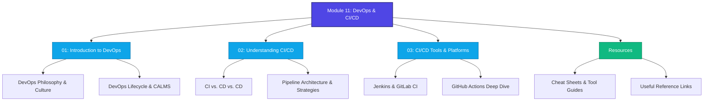

# Module 11: DevOps and CI/CD (Continuous Integration / Continuous Deployment)

Welcome to **Module 11: DevOps and CI/CD**. This module is designed to provide you with a comprehensive, industry-aligned understanding of DevOps philosophy, culture, and the technical implementation of CI/CD pipelines.

By the end of this module, you will understand how modern software engineering teams build, test, and release software at high velocity, safety, and scale.

---

##  Module Roadmap & Structure

This module is structured into three main chapters, accompanied by practical resources and cheat sheets:



### Directory Layout

```text
Module-11-DevOps-and-CICD/
│
├── README.md                          <- (You are here) Module Syllabus & Guide
│
├── 01-Introduction-to-DevOps/
│   ├── README.md                      <- Chapter 1 Overview & Learning Objectives
│   └── Notes.md                       <- DevOps History, Philosophy, and Culture
│
├── 02-Understanding-CI-CD/
│   ├── README.md                      <- Chapter 2 Overview & Learning Objectives
│   └── Notes.md                       <- CI/CD Pipelines, Tests, and Deployments
│
├── 03-CI-CD-Tools-and-Platforms/
│   ├── README.md                      <- Chapter 3 Overview & Learning Objectives
│   └── Notes.md                       <- Tools Deep Dive (GitHub Actions, Jenkins)
│
└── Resources/
    ├── DevOps-Cheat-Sheet.md          <- Quick definitions and DevOps commands
    ├── CI-CD-Cheat-Sheet.md           <- YAML schemas, boilerplate pipelines
    ├── Popular-DevOps-Tools.md        <- Categorized index of modern tools
    └── Useful-Links.md                <- Documentation, books, and courses
```

---

## Learning Objectives

After completing this module, you will be able to:

1. **Explain the Cultural Shift**: Articulate the history and business value of DevOps, moving away from traditional siloed software delivery models.
2. **Apply the CALMS Framework**: Evaluate organizations and workflows using the Culture, Automation, Lean, Measurement, and Sharing principles.
3. **Analyze Pipeline Stages**: Diagram the stages of a modern CI/CD pipeline, explaining the role of unit, integration, and security tests.
4. **Contrast Delivery & Deployment**: Clearly explain the distinction between Continuous Delivery (manual release approval) and Continuous Deployment (automated production release).
5. **Differentiate Deployment Patterns**: Assess and choose between Blue-Green, Canary, Rolling, and Recreate deployment strategies based on application requirements.
6. **Construct Pipeline Definitions**: Write real-world, functional CI/CD configurations using YAML for platforms like GitHub Actions and GitLab CI.

---

##  Prerequisites

To get the most out of this module, you should have:
* **Basic Git/GitHub Knowledge**: Understanding commits, branching, merging, and pull requests.
* **Basic Linux CLI**: Familiarity with basic terminal commands (`cd`, `ls`, environment variables).
* **Familiarity with JSON/YAML**: Understanding basic data serialization formats.
* **Application Fundamentals**: Knowing how an application is compiled, tested, and packaged (e.g., Node.js/npm, Python/pip, or Maven/Java).

---

## Study Recommendations

1. **Step-by-Step Approach**: Start with [Chapter 1 Notes](file:///c:/Users/subbu/Downloads/Module-11-DevOps-and-CICD/01-Introduction-to-DevOps/Notes.md) to understand the *why* of DevOps before moving to the *how* in Chapters 2 and 3.
2. **Hands-on Practice**: Follow along with the YAML pipeline structures provided in [Chapter 3 Notes](file:///c:/Users/subbu/Downloads/Module-11-DevOps-and-CICD/03-CI-CD-Tools-and-Platforms/Notes.md) and [CI/CD Cheat Sheet](file:///c:/Users/subbu/Downloads/Module-11-DevOps-and-CICD/Resources/CI-CD-Cheat-Sheet.md).
3. **Use the Resources**: Check out [Popular-DevOps-Tools.md](file:///c:/Users/subbu/Downloads/Module-11-DevOps-and-CICD/Resources/Popular-DevOps-Tools.md) to contextualize how different tools integrate into the broader software delivery ecosystem.
