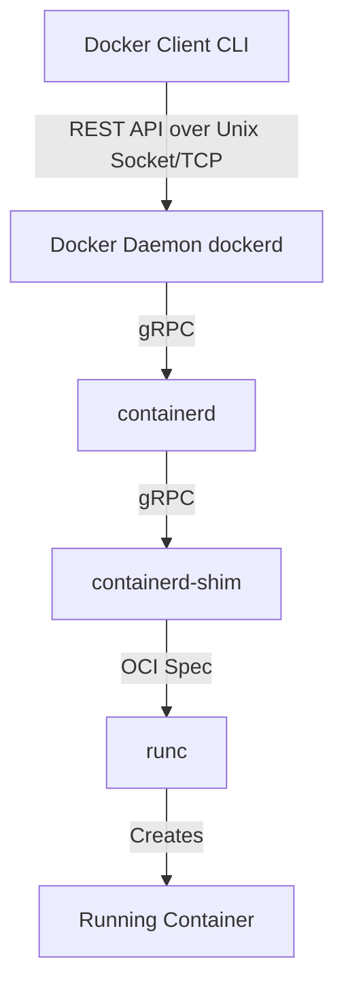

# Docker Engine Architecture & Mechanics - Study Notes

To master Docker, you must understand its architecture and how it leverages core Linux kernel primitives to achieve isolation and virtualization without a hypervisor.

---

## 1. Docker Client-Server Architecture

Docker is built on a client-server architecture model.

### Components:
* **Docker Client (`docker` CLI)**: The CLI client that accepts user commands. It communicates with the Docker Daemon via a REST API. This communication can happen locally over a Unix Socket (`/var/run/docker.sock`) or remotely over a TCP network socket.
* **Docker Daemon (`dockerd`)**: A persistent background process that manages Docker objects such as images, containers, networks, and volumes. It listens to Docker API requests and coordinates high-level tasks.
* **containerd**: A standalone container runtime manager. It supervises the container lifecycle, pulls images, sets up network interfaces, and monitors container processes.
* **containerd-shim**: A lightweight process that allows daemon-less containers. It remains running while the container runs, keeping stdout/stderr open, and reports the exit status of the container back to `containerd` so that `dockerd` can be restarted/upgraded without stopping running containers.
* **runc**: A lightweight, low-level CLI tool for spawning and running containers according to the **Open Container Initiative (OCI)** specification. It directly invokes Linux kernel system calls to build namespaces and cgroups, starts the container process, and immediately exits.

---

## 2. Kernel Isolation Technologies

Unlike virtual machines that package an entire Guest OS, Docker containers run directly on the host kernel. They achieve isolation using two fundamental Linux kernel technologies:

### A. Namespaces (Who can you see?)
Namespaces partition kernel resources so that one set of processes sees one set of resources, while another set of processes sees a completely different set.

| Namespace | Isolates | What it does |
|---|---|---|
| **`PID`** | Process IDs | The container process thinks it is PID 1, and cannot see host processes. |
| **`NET`** | Network interfaces | Container gets its own virtual network interface, route tables, and port space. |
| **`MNT`** | Mount points | Container has its own isolated file system view (chroot-like). |
| **`IPC`** | Interprocess Communication | Prevents processes in different containers from accessing shared memory. |
| **`UTS`** | Hostnames | Allows the container to have its own hostname and domain name. |
| **`USER`** | User & Group IDs | Maps root UID `0` inside the container to a non-privileged UID on the host. |

### B. Control Groups (cgroups) (How much can you consume?)
Control Groups (cgroups) monitor and limit resources (CPU, Memory, Disk I/O, Network I/O) that a set of processes can consume.
* Prevents a single container from causing system-wide degradation (e.g. running out of memory and triggering the Linux Out-Of-Memory (OOM) killer).

---

## 3. Storage and Logging Drivers

### Storage Drivers
Docker uses storage drivers to write to the read-write layer of a container. Storage drivers use Copy-on-Write (CoW) technology to minimize disk usage and build times.
* **`overlay2`**: The standard storage driver on modern Linux distributions. It overlays a `diff` directory (the container's read-write changes) on top of the image's lower read-only directories to create a unified view.

### Logging Drivers
Docker captures the `stdout` and `stderr` streams of container processes and routes them through a configured logging driver.
* **`json-file`** (Default): Stores logs locally in JSON format on the host (`/var/lib/docker/containers/<id>/<id>-json.log`).
* **`journald`**: Routes logs to the host's systemd journal.
* **`syslog`, `gelf`, `fluentd`**: Ship logs to centralized logging aggregation platforms.
* **`local`**: A highly efficient driver that utilizes circular ring buffers to prevent logs from exhausting disk space.
