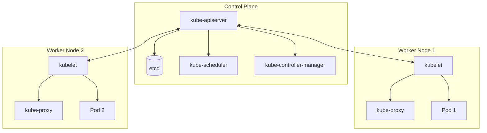

# Kubernetes (K8s) Overview & Transition Guide

Kubernetes is an open-source system designed by Google for automating deployment, scaling, and management of containerized applications. This guide serves as a bridge from single-host Docker configurations to clustered Kubernetes environments.

---

## 1. Kubernetes Architecture

A Kubernetes cluster contains two major component areas: the **Control Plane** (managing the cluster) and **Worker Nodes** (running workloads).



### Control Plane Components (The Brains)
* **`kube-apiserver`**: The front door to Kubernetes. It exposes the REST API and accepts administrative commands (usually via `kubectl`).
* **`etcd`**: A highly-available, distributed key-value database that stores all cluster configuration and state metadata.
* **`kube-scheduler`**: Watches for newly created Pods and assigns them to worker nodes based on resource availability, hardware limits, and affinity.
* **`kube-controller-manager`**: Runs controller processes that regulate the cluster state (e.g.Node Controller, Job Controller, Deployment Controller).

### Worker Node Components (The Workhorses)
* **`kubelet`**: An agent that runs on every node in the cluster. It ensures containers are running in Pods as defined by the API specs.
* **`kube-proxy`**: A network proxy running on each node that maintains network rules, allowing network communication to Pods from inside or outside the cluster.
* **Container Runtime**: The software responsible for running containers (e.g. `containerd`, `CRI-O`).

---

## 2. Core Kubernetes API Objects

In Kubernetes, you define resource structures declaratively using YAML manifests.

* **Pod**: The smallest unit of execution. A Pod encapsulates one or more container processes, shared storage, and a unique network IP space. Pods are ephemeral.
* **Deployment**: Controls the lifecycle of Pods. It manages replica counts, rolling updates, and self-healing.
* **Service**: An abstract way to expose an application running on a set of Pods as a network service. It provides a stable IP address and DNS name, distributing traffic across Pods.
* **ConfigMap / Secret**: Objects used to store non-confidential configuration data and sensitive credentials (passwords, TLS certs) separately from application container images.
* **PersistentVolume (PV) / PersistentVolumeClaim (PVC)**: Decoupled storage abstractions that request and map physical network storage volumes to Pod filesystems.

---

## 3. Transitioning from Docker Compose to Kubernetes

When moving from Docker Compose to Kubernetes, your structural mental model maps like this:

| Docker Compose Concept | Kubernetes Equivalent |
|---|---|
| A container in `services` | A container inside a **Pod** |
| `docker-compose.yml` file | A collection of **Deployment** and **Service** YAML manifests |
| Service linking/discovery (DNS) | **Service** DNS resolution |
| Shared Named volumes | **PersistentVolumeClaims (PVC)** mapped to Pod mount points |
| `environment:` key | **ConfigMap** or **Secret** volume injections |

### Example Mapping:

**Docker Compose**:
```yaml
services:
  web:
    image: nginx:alpine
    ports:
      - "80:80"
```

**Kubernetes Deployment**:
```yaml
apiVersion: apps/v1
kind: Deployment
metadata:
  name: nginx-deployment
spec:
  replicas: 2
  selector:
    matchLabels:
      app: nginx
  template:
    metadata:
      labels:
        app: nginx
    spec:
      containers:
      - name: nginx
        image: nginx:alpine
        ports:
        - containerPort: 80
```

---

## 4. Getting Started Locally

To play with Kubernetes on a development computer:
1. Install **[Minikube](https://minikube.sigs.k8s.io/)** (runs a single-node cluster inside Docker or a VM).
2. Install **`kubectl`** (the K8s CLI tool).
3. Start cluster:
   ```bash
   minikube start
   ```
4. Query node status:
   ```bash
   kubectl get nodes
   ```
