# Agile vs. Waterfall: A Comparative Guide

To understand why modern product teams choose Agile, we must contrast it with the traditional **Waterfall** (or Plan-Driven) approach. This guide breaks down the core structural differences, risk profiles, and appropriate use cases for both.

---

## Side-by-Side Comparison

| Feature | Waterfall (Predictive) | Agile (Adaptive) |
| :--- | :--- | :--- |
| **Approach** | Linear, sequential, and phase-gate. | Iterative, incremental, and evolutionary. |
| **Requirements** | Defined upfront; changes are tightly controlled. | Dynamic; backlogs are refined and prioritized continuously. |
| **Customer Involvement** | High at the start (requirements) and end (delivery). | High throughout (weekly/bi-weekly reviews). |
| **Testing** | Occurs as a dedicated phase near the end of the project. | Integrated into every iteration (continuous quality assurance). |
| **Delivery** | Single major release at the end of the project. | Frequent releases of working software (increments). |
| **Risk Profile** | High risk; issues are found late during integration/testing. | Low risk; issues are identified early through regular feedback. |
| **Primary Metric** | Conformance to plan and budget. | Working software and customer satisfaction. |

---

## Risk Accumulation Profiles

One of the most compelling arguments for Agile is how it manages risk. 

In a **Waterfall** project, risk builds up over time and only drops when the software is integrated and tested at the very end. If a critical architectural defect is found during the testing phase, fixing it can bust the budget and schedule.

In an **Agile** project, risk is reduced at the end of *every sprint* because the team builds, integrates, and tests working code regularly.

```mermaid
gantt
    title Risk over Time Comparison
    dateFormat  X
    axisFormat %d
    
    section Waterfall Risk
    High Risk Phase (Planning to Testing) : active, 0, 80
    Risk Reduction (Late testing/delivery) : 80, 100
    
    section Agile Risk
    Sprint 1 (Risk Peak & Drop) : active, 0, 20
    Sprint 2 (Risk Peak & Drop) : active, 20, 40
    Sprint 3 (Risk Peak & Drop) : active, 40, 60
    Sprint 4 (Risk Peak & Drop) : active, 60, 80
    Sprint 5 (Risk Peak & Drop) : active, 80, 100
```

---

## When to Use Which?

Choosing the right methodology depends on the nature of the project.

### Use Waterfall When:
1. **Clear, Fixed Requirements**: The requirements are well understood, stable, and unlikely to change (e.g., building a simple database migration utility).
2. **Highly Regulated Domains**: Aerospace, medical devices, or infrastructure projects where rigid compliance, strict documentation, and validation protocols are legally required before code can be written.
3. **Known Technology**: The team has built similar systems many times before using the exact same technology stack.
4. **Predictable Timelines Needed**: The client requires a fixed-price contract with rigid timelines and has no interest in collaborating during development.

### Use Agile When:
1. **Dynamic Requirements**: The product is new, and requirements are expected to evolve as users interact with early versions (e.g., startup SaaS apps).
2. **High Innovation/Complexity**: The project involves new technologies or solves novel problems where the team must experiment, learn, and adapt.
3. **Speed to Market is Key**: The client wants to launch a Minimum Viable Product (MVP) quickly to capture market share, then iteratively add features.
4. **Collaborative Partnerships**: The customer/Product Owner is available and eager to give regular feedback and help guide the product direction.

> [!WARNING]
> Attempting to use Waterfall processes (like freezing requirements or demanding fixed deadlines) inside an Agile team is a common failure pattern known as "Water-Scrum-Fall." It creates high friction, kills team morale, and prevents genuine agility.
