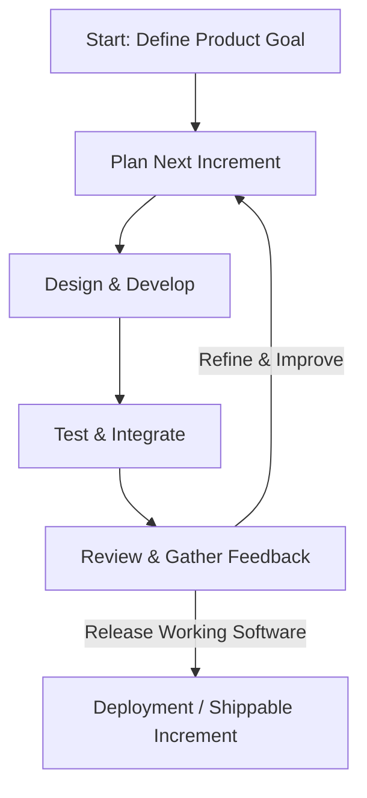

# Introductory Notes: The Genesis of Agile

Software development has undergone a major paradigm shift. To understand Agile, we must first look at the historical context and the fundamental challenges that led to its creation.

---

## Historical Context: The "Software Crisis"

In the early decades of computing (1960s-1980s), software engineering borrowed methodologies from civil and mechanical engineering. Building software was treated like building a bridge or a skyscraper:
1. **Upfront Planning**: All requirements were documented before coding began.
2. **Sequential Phase**: Work flowed through rigid, sequential phases (Requirements -> Design -> Coding -> Testing -> Deployment).
3. **No Backtracking**: Once a phase was finished, returning to it was extremely costly and discouraged.

This approach is known as the **Waterfall model**. 

### The Problem: The Chaos Report (1994)
As software systems grew in complexity, Waterfall struggled. The Standish Group's landmark 1994 *Chaos Report* revealed:
* Only **16.2%** of software projects were completed on-time and on-budget.
* Over **31%** of projects were cancelled before completion.
* The primary causes of failure were:
  * Lack of user input
  * Incomplete or changing requirements
  * Unrealistic expectations

Traditional engineering assumes a predictable domain (materials behave consistently, requirements don't change midway). Software engineering operates in a complex, adaptive domain (requirements evolve, technology shifts, and users discover what they need only when they see it).

---

## The Rise of "Lightweight" Methods

During the 1990s, several software pioneers began experimenting with alternative, faster, and more collaborative frameworks. These were collectively called **"Lightweight Methods"** because they discarded heavy documentation and rigid processes in favor of:
* Rapid feedback loops.
* Self-organizing teams.
* Working software over paperwork.

Prominent methods included:
* **Scrum** (Jeff Sutherland, Ken Schwaber)
* **Extreme Programming (XP)** (Kent Beck)
* **Feature-Driven Development (FDD)**
* **Dynamic Systems Development Method (DSDM)**

In 2001, seventeen practitioners of these methods met in Snowbird, Utah, leading to the creation of the **Agile Manifesto** (explored in Chapter 02).

---

## Iterative vs. Incremental Development

A core concept of Agile is the combination of **Iterative** and **Incremental** development. People often confuse these terms, but they represent distinct strategies.

### 1. Incremental Development (Building in Parts)
You break the system down into small, functional slices (increments). You build and deliver one slice at a time.
* *Example*: Building an e-commerce store. Sprint 1 delivers the Product Catalog. Sprint 2 delivers the Cart. Sprint 3 delivers Checkout.
* *Key Benefit*: You deliver working value to the user early and continuously.

### 2. Iterative Development (Refining and Polishing)
You build a crude version of the entire system first, and then repeatedly refine and polish it based on feedback.
* *Example*: Drawing a portrait. First, sketch the outlines (rough). Next, add basic shapes and colors. Finally, add shadows, highlights, and fine details.
* *Key Benefit*: You can pivot the entire product design quickly as you learn more.

### 3. The Agile Way: Both Combined!
Agile combines these two. In each sprint, you deliver a small, functional increment (Incremental), and you refine previous increments based on user feedback (Iterative).

> [!TIP]
> **The Mona Lisa Analogy (by Jeff Patton):**
> * **Waterfall**: Paint the top third of the canvas perfectly, then the middle third, then the bottom third. You only see the full picture at the very end.
> * **Iterative & Incremental**: Sketch the entire Mona Lisa roughly. Then, add color to the face and hands. Then, detail the background and adjust the colors. You have a view of the whole picture from the start and can adjust it as you go.
