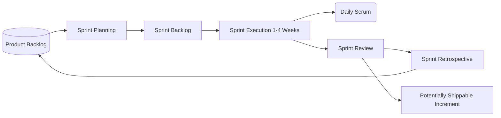

# The Scrum Framework

Scrum is a lightweight framework that helps people, teams, and organizations generate value through adaptive solutions for complex problems. It is the most popular Agile framework in the industry today.

---

## Section Contents

* **[Scrum Notes](./Notes.md)**: Explore empirical process control (transparency, inspection, adaptation) and the Scrum values.
* **[Scrum Roles](./Scrum-Roles.md)**: Detailed analysis of the Product Owner, Scrum Master, and Developers.
* **[Scrum Ceremonies](./Scrum-Ceremonies.md)**: Learn about Sprint Planning, Daily Scrum, Sprint Review, and Sprint Retrospective.
* **[Scrum Artifacts](./Scrum-Artifacts.md)**: Master the Product Backlog, Sprint Backlog, and the Increments.
* **[Definition of Done](./Definition-of-Done.md)**: Understand what constitutes a "shippable" increment and draft your first checklist.

---

## Learning Goals

In this section, you will learn:
* The core feedback loops inside Scrum.
* How Scrum roles form a cross-functional, self-organizing unit.
* How to maintain the three Scrum pillars (Transparency, Inspection, Adaptation).

---

## Scrum Lifecycle Overview

The following diagram illustrates how product requirements flow from the Product Backlog into a Sprint and emerge as a valuable, shippable Increment:

